# Azure AI Foundry Agent To M365 Copilot
Making an Azure AI Foundry Agent available in M365 Copilot, using M365 Agents SDK/Toolkit.

View the video to see how it works and part of the tutorial:

[](https://www.youtube.com/watch?v=U9Yv2vjKYbI)

To use this sample, you'll need:

- Visual Studio 2022 17.14 (May 2025)
- Microsoft 365 Agents Toolkit (feature named 'Microsoft 365 Agents Toolkit' in VS Installer under "Individual components")
- Use the Azure CLI and 'az login' on your Azure tenant containing your Azure AI Foundry project. Your identity will be used to connect to the Azure AI Foundry Project.

Then, create an Agent in the Azure AI Foundry portal, under the project part. Configure the model, instructions, tools, etc. you'd like. 

If you're looking for a sample on how to create your Foundry agent, check the tutorial at the end to create the Stock Agent to query an API to get a specific stock value on a specific timeslot.

If you're not familiar yet with Azure AI Foundry Projet & Agent Service:
- [Announcing Developer Essentials for Agents and Apps in Azure AI Foundry](https://devblogs.microsoft.com/foundry/announcing-developer-essentials-for-agents-and-apps-in-azure-ai-foundry/)
- [Announcing General Availability of Azure AI Foundry Agent Service](https://techcommunity.microsoft.com/blog/azure-ai-services-blog/announcing-general-availability-of-azure-ai-foundry-agent-service/4414352) 

Go inside the Azure AI Foundry Portal and get the endpoint as well as the ID of your agent:

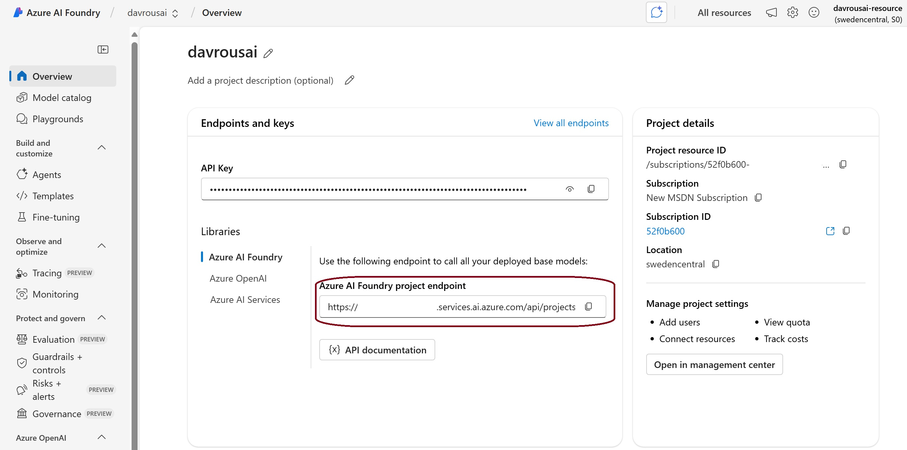

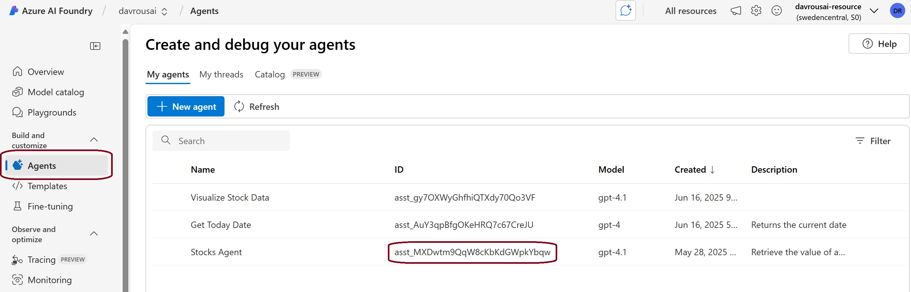

Open the solution in VS 2022 and modify '**appsettings.json**' to update:

- **AzureAIFoundryProjectEndpoint** with the value coming from your Azure AI Foundry portal
- **AgentID** is the ID of the agent you've created. It starts by 'asst_....'

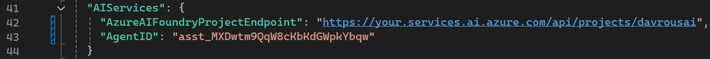

# Without M365 Agents Toolkit

You'll need only the AzureAgentToM365ATK C# project. Select it as the project to debug and set the debugging to 'Start Project'

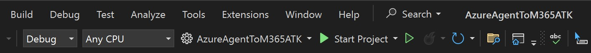

Press F5. It will run locally the agent on your machine. 

You can install the [Bot Framework Emulator (v4)](https://github.com/microsoft/BotFramework-Emulator) and connect to the Agent using http://localhost:5130/api/messages 

Next step is to make it available via a public URL with a Dev Tunnel, create a Azure Bot Registration in the Azure Portal and fill the various properties in '**appsettings.json**' such as the ClientID, BOT_ID, BOT_TENANT_ID, etc.

To deploy it in Teams or M365 Copilot, you'll need to also update the '**manifest.json**' file, zip the folder and upload it to Teams / M365 Copilot via the App maangement UX. 

Otherwise, use hte Microsoft 365 Agents Toolkit to simplify those steps. 

# With M365 Agents Toolkit

## With the M365 Agents Playground
Select "Microsoft 365 Agents Playground (browser)" as the target.

Press F5, it will start the local ASP.NET server to host the agent on your machine and will open the 'Microsoft 365 Agents Playground' tool. Try that you can discuss with the agent in the emulator.

## Inside Microsoft Teams
Now, to try the experience in Teams or Microsoft 365 Copilot, you need a M365 tenant and be logged in.

Right-click the 'M365Agent' project, select 'Microsoft 365 Agents Toolkit', 'Select Microsoft 365 Account' and select the right account where you'd like to deploy your M365 Agent. 

If not done yet, create a Dev Tunnel and then select it.

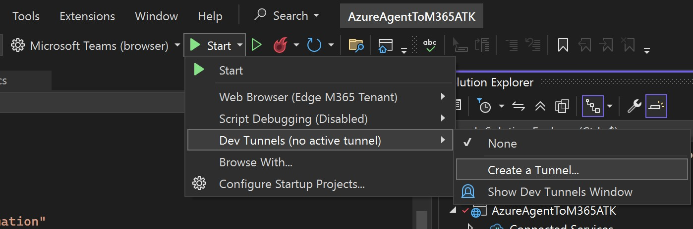

And make it public & persistent:

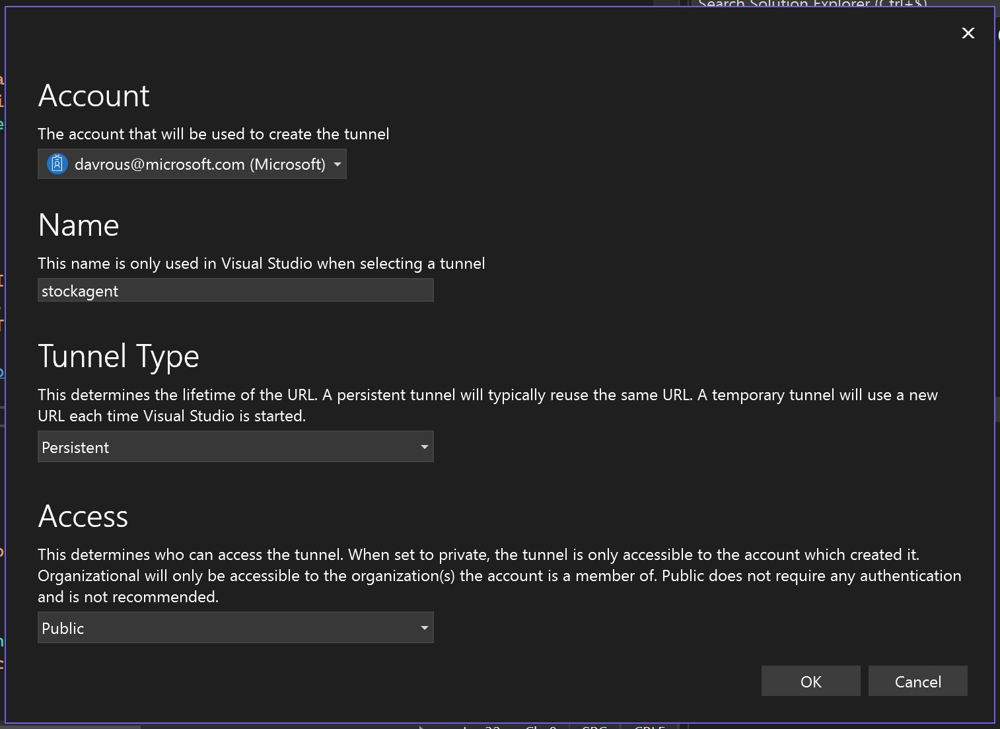

Change the debbuging target to 'Microsoft Teams (browser)'. If you have multiple Edge profiles, select the one matching the M365 Account you've been using before. You potentially need to create a new browser profile in VS by selecting 'Browse With...' and create a new decidated one for the targeted M365 Tenant.

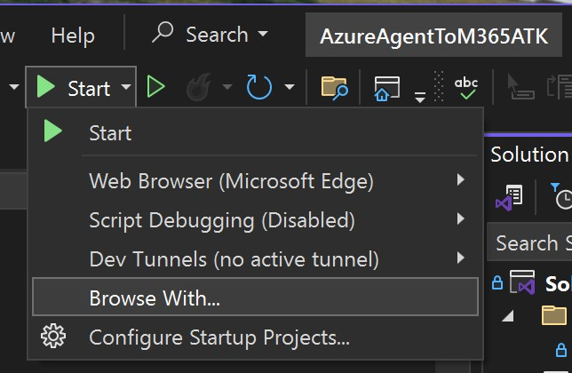

Then, create a new browser profile using that:

- Program: C:\Program Files (x86)\Microsoft\Edge\Application\msedge.exe
- Arguments: --profile-directory="Profile x" (find the profile number matching your account)
- Friendly name: Edge M365 Tenant

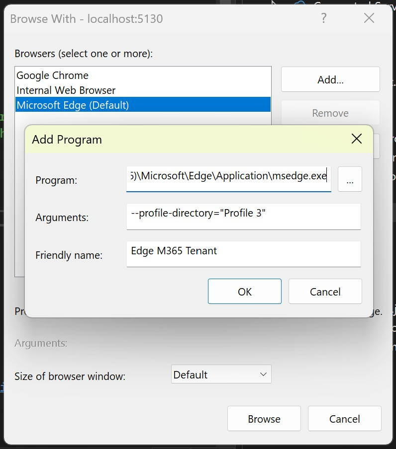

Make this Edge profile as the default one.

Press F5. 

M365 Agents Toolkit should go through 8 different steps, to create various registration, packaging, sideloading, etc. And if everything worked fine, the selected browser will open to install the Agent in Teams. 

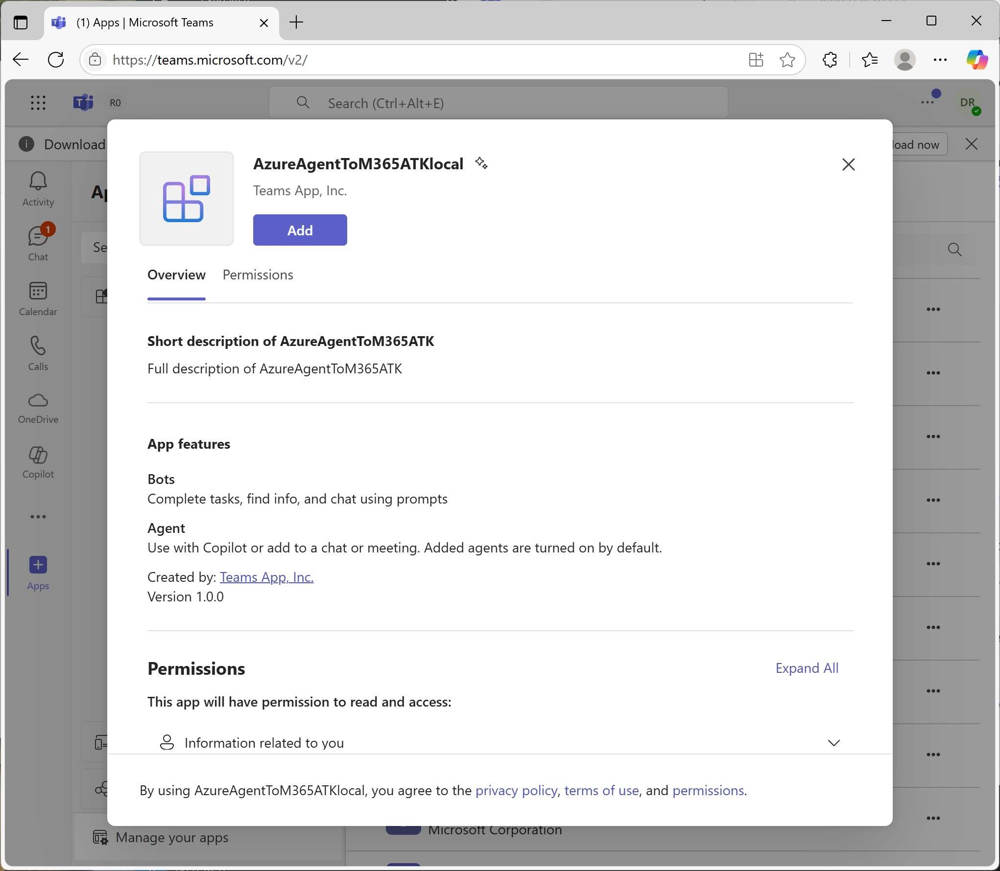

You should be able to open it either in Teams or M365 Copilot.

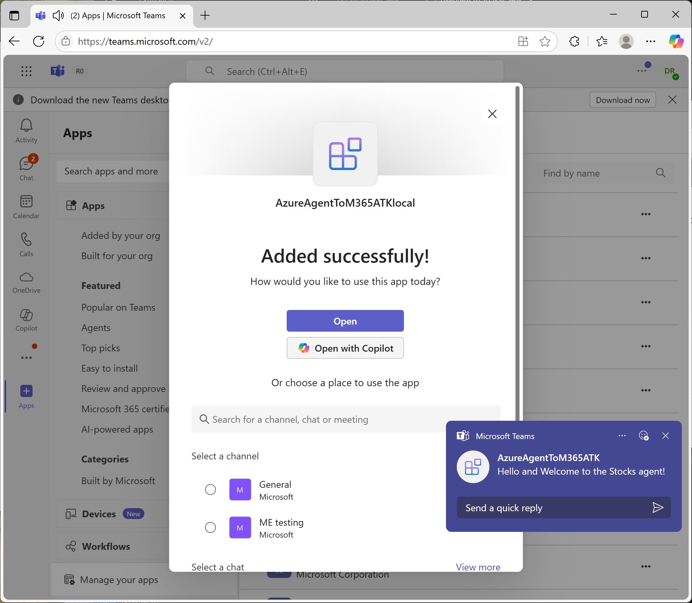

To try it directly in M365 Copilot by clicking on "Open with Copilot" or go to https://m365copilot.com/ if you started with Teams first. Your agent should be visible in the left trail. 

Sample demo in Teams:
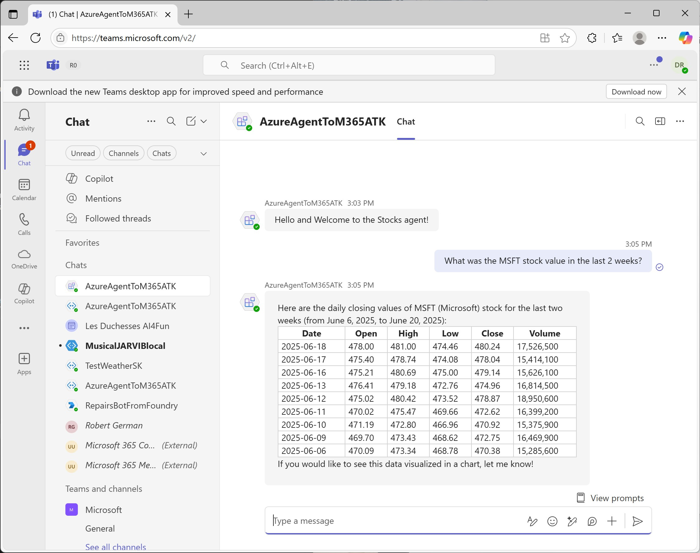

Sample demo in M365 Copilot:
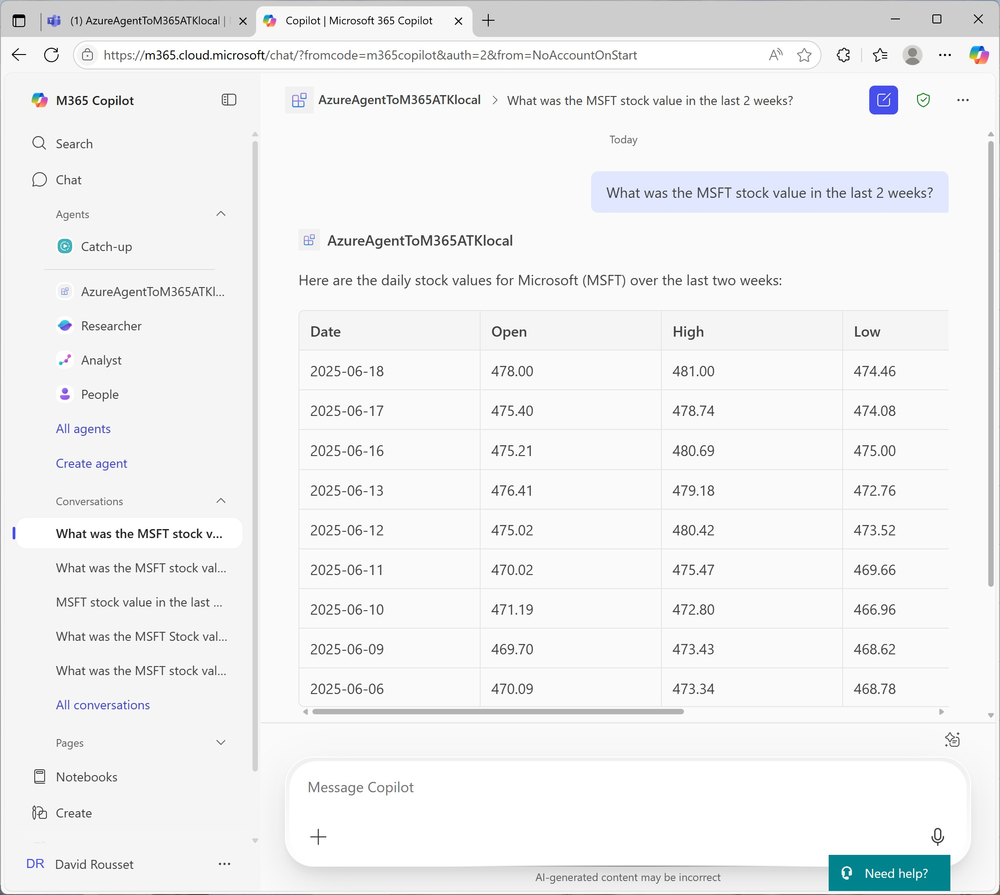

# Additional ressources 

* [Connect a bot to Twilio (SMS)](https://learn.microsoft.com/en-us/azure/bot-service/bot-service-channel-connect-twilio?view=azure-bot-service-4.0)
* [Connect a bot to Slack](https://learn.microsoft.com/en-us/azure/bot-service/bot-service-channel-connect-slack?view=azure-bot-service-4.0)
* A complete step-by-step lab on this topic: [Build your own agent with the M365 Agents SDK and Semantic Kernel](https://microsoft.github.io/copilot-camp/pages/custom-engine/agents-sdk/)

# (Optional) Tutorial - Creating the Stock Agent in Azure AI Foundry

If you'd like to use the same Azure AI Foundry Agent I've used in my video & screenshots, here are the steps to follow.

* Create a new Agent in Foundry with the following details:
    * Name: "Stocks Agent"
    * Deployment: Use gpt-4o or gpt4.1 (works well also with gpt4-turbo)
    * Instructions: "You are an agent to search for a specific stock value using the function 'getTimeSeries'. Show the data in a table except if there is a unique value returned. end_date MUST be strictly superior to start_date, never send the same value for the 2 parameters"
    * Agent Description: "Retrieve the value of a stock at a specific time"

* Create a connection to manage the auth key to the API we'd like to call:
    * Follow the documentation: [Authenticating with API Key](https://learn.microsoft.com/en-us/azure/ai-foundry/agents/how-to/tools/openapi-spec#authenticating-with-api-key).
    * The API we're going to use from https://support.twelvedata.com/en/articles/5335783-trial requires you to register to get a free key but you can also use the 'demo' key that will only be able to answer to a super limited set of stock values (such as AAPL). The key is provided via a query string parameter approach.
    * Go to the "Management Center" of Foundry and create a "New connection"
    * Choose "Custom keys" and the end of the selection page
    * Create the key value pairs with "apikey" and the name and your own key as the value (or 'demo')
    * Check "is secret"
    * Name it "StockAPI" and save it

Go back to your agent in the Azure AI Foundry projet portal. 

* Add an Action to your agent using the "OpenAPI 3.0 specified tool"
    * Name: "StocksAPI"
    * Description: "API for retrieving historical time series data for financial instruments with optional filters like `start_date`, `end_date`, and `outputsize`."
    * For the Authentication method, select "Connection" then choose the "StockAPI" connection we've just created above.
    * Copy/paste the following OpenAPI descriptor for the API to call:
```json
{
  "openapi": "3.0.3",
  "info": {
    "title": "Twelve Data Time Series API",
    "description": "API for retrieving historical time series data for financial instruments with optional filters like `start_date`, `end_date`, and `outputsize`.",
    "version": "1.0.0"
  },
  "servers": [
    {
      "url": "https://api.twelvedata.com"
    }
  ],
  "paths": {
    "/time_series": {
      "get": {
        "summary": "Retrieve historical time series data",
        "description": "Retrieves historical time series data for a specified financial instrument.  The `start_date` and `end_date` parameters can be used to define boundaries for the data.  The maximum number of data points in one request is 5000.",
        "parameters": [
          {
            "name": "symbol",
            "in": "query",
            "required": true,
            "description": "The symbol of the financial instrument (e.g., AAPL for Apple Inc.).",
            "schema": {
              "type": "string"
            }
          },
          {
            "name": "interval",
            "in": "query",
            "required": true,
            "description": "The time interval between data points (e.g., 1day, 1min).",
            "schema": {
              "type": "string"
            }
          },
          {
            "name": "start_date",
            "in": "query",
            "required": false,
            "description": "The start date of the time series data in ISO format (YYYY-MM-DD).  Must be greater than `outputsize` if used alone. Must be absolutely strictly inferior to `end_date`",
            "schema": {
              "type": "string",
              "format": "date"
            }
          },
          {
            "name": "end_date",
            "in": "query",
            "required": false,
            "description": "The end date of the time series data in ISO format (YYYY-MM-DD).  Defines the upper limit of the data range. Must be absolutely strictly superior to `start_date`",
            "schema": {
              "type": "string",
              "format": "date"
            }
          },
          {
            "name": "outputsize",
            "in": "query",
            "required": false,
            "description": "The number of data points to return.  Defaults to 30 if not specified. Maximum value is 5000.",
            "schema": {
              "type": "integer"
            }
          },
          {
            "name": "apikey",
            "in": "query",
            "required": true,
            "description": "Your API key for authentication.",
            "schema": {
              "type": "string"
            }
          }
        ],
        "responses": {
          "200": {
            "description": "A successful response with the time series data.",
            "content": {
              "application/json": {
                "schema": {
                  "type": "object",
                  "properties": {
                    "meta": {
                      "type": "object",
                      "description": "Metadata about the request and time series."
                    },
                    "values": {
                      "type": "array",
                      "description": "The list of time series data points.",
                      "items": {
                        "type": "object",
                        "properties": {
                          "datetime": {
                            "type": "string",
                            "format": "date-time",
                            "description": "The timestamp of the data point."
                          },
                          "open": {
                            "type": "number",
                            "description": "The opening price."
                          },
                          "high": {
                            "type": "number",
                            "description": "The highest price."
                          },
                          "low": {
                            "type": "number",
                            "description": "The lowest price."
                          },
                          "close": {
                            "type": "number",
                            "description": "The closing price."
                          },
                          "volume": {
                            "type": "integer",
                            "description": "The traded volume."
                          }
                        }
                      }
                    }
                  }
                }
              }
            }
          },
          "400": {
            "description": "Bad request due to invalid parameters."
          },
          "401": {
            "description": "Unauthorized, invalid API key."
          },
          "500": {
            "description": "Internal server error."
          }
        },
        "operationId": "getTimeSeries"
      }
    }
  },
  "components": {
    "securitySchemes": {
      "ApiKeyAuth": {
        "type": "apiKey",
        "in": "query",
        "name": "apikey"
      }
    }
  },
  "security": [
    {
      "ApiKeyAuth": []
    }
  ]
}
```
* Click "Next" and then "Create Tool"

Try to play with the agent int the Playground and ask *"What was the MSFT stock value in the last 2 weeks?"*.

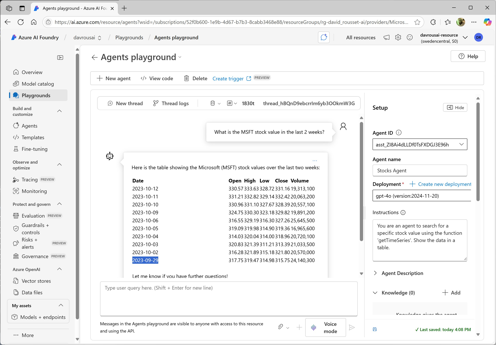

You can see that the values are not on right period in time. It's because the agent doesn't know what is today's date. You need to help it. 

To solve that, we need to use the Code Interpreter action that will use Python to get today's date (or even to compute the right period in time required).

* Create a new Agent with the following details:
    * Name: "Get Today Date"
    * Deployment: Use gpt-4o or gpt4.1 (works well also with gpt4-turbo)
    * Instructions: "Using the code interpreter feature, please find the current today date and returns its value to be used by another agent"
    * Agent Description: "Returns the current date"
* Add the "Code Interpreter" action with the default parameters
* Go back to your "Stocks Agent" 
    * Add a "Connect agent"
    * Select the "Get Today Date" agent and use "GetTodayDate" as the unique name.
    * Steps to activate the agent: "Use this agent when you need to know the current today's date"
    * Click "Add"

Go back to the Playground and ask the same question again. It now works as expected. 

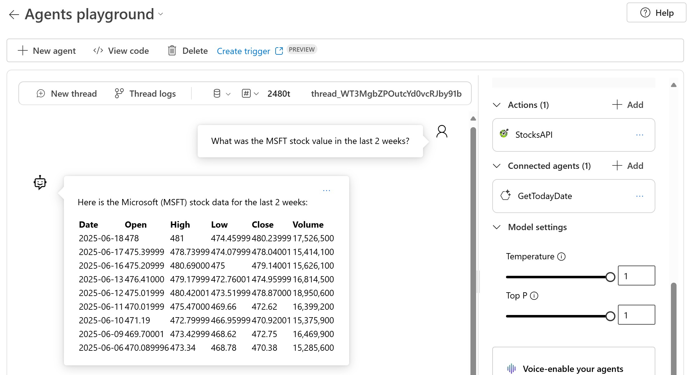

You can even see how the actions selection process happened by clicking on "Threads logs":

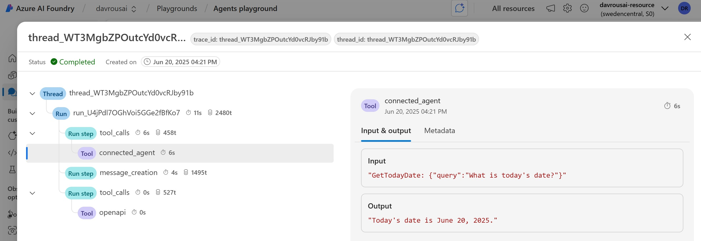


